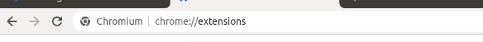
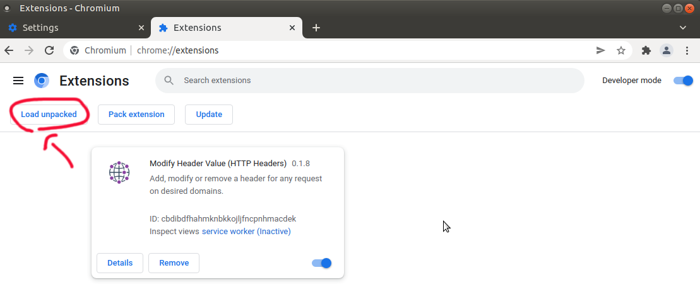

### Downloading
1. Open https://github.com/momijizukamori/site2epub/tree/master/web-ext-artifacts
2. Click on the extension for the site you want - each site has a different extension.
3. Because this is a compressed file, Github will not show the contents by default. Click on the download button, and you'll get a standard browser download prompt for the zip.
	

The steps to install will vary depending on whether your browser is Firefox or Chrome.

### Firefox

1. Open `about:debugging` in your address bar and navigate to it
	

2. Click 'This Firefox' in the sidebar
	

3. Click 'Load Temporary Addon-on'
	

4. Navigate to the folder where you saved the zip file and select it (your folder navigator may look different, depending on your operating system)
	

5. The addon will now appear under 'Temporary Extentions'
	

6. When you navigate to an appropriate index page on the site, a small orange icon will appear in your address bar.
	

### Chrome

1. Unzip the downloaded file somewhere you'll remember
2. Open `chrome://extensions/` in your address bar and navigate to it
	

3. Toggle the 'Developer mode' toggle in the upper right corner to on.
	

4. Click 'Load unpacked extension'
	

5. Navigate to inside the folder with the zip file's contents, and select 'Open' (your folder navigator may look different, depending on your operating system)
	

6. The addon will now appear in the list, with a small red icon indicating that it's an unpacked addon.
	

7. By default, Google puts icons for new extensions into a dropdown. Click on the puzzle-piece icon on your address bar to access it
	

8. When you navigate to an appropriate index page on the site and click the puzzle-piece icon, the extension and orange icon will show as having full access to the site.
	
